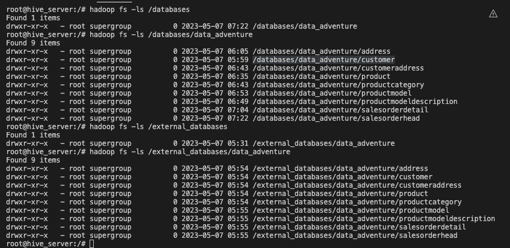
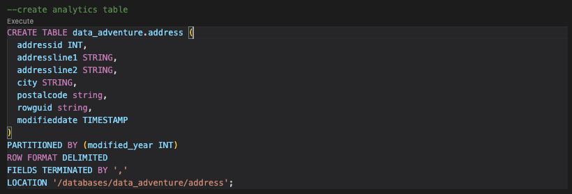
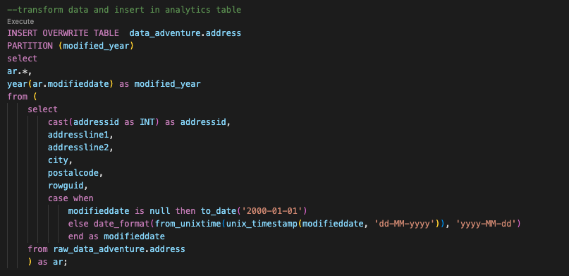
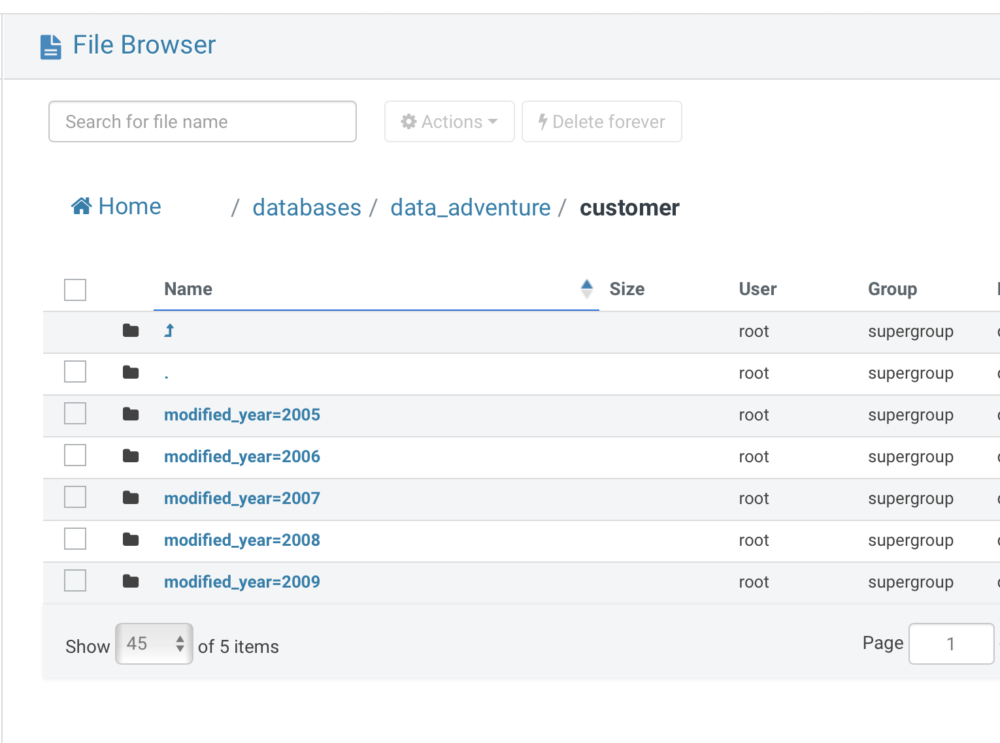

## Hadoop Hive
O objetivo desse trabalho é importar arquivos CSV para o HDFS e criar tabelas dentro do Hive a partir deles, realizando as transformações necessárias e gerando duas tabelas analíticas que consolidam os dados em alguma dimensão.

O ambiente Docker encontrado no repositório https://github.com/fabiogjardim/bigdata_docker foi utilizado para realizar este trabalho.

### Iniciando o Docker e movendo arquivos para dentro do container:
O Docker deve ser iniciado na máquina e acessado o repositório em questão, indo até a pasta bigdata_docker e executando os seguintes comandos:
- docker compose up -d
- Em seguida, deve-se voltar para a pasta raiz do repositório e executar o comando "docker ps --format '{{.Names}}'".
- Deve ser verificado se o hive-server está listado.

As próximas etapas envolvem a transferência dos arquivos e pastas necessários para o container hive-server. Siga os passos abaixo, mas primeiro volte a pasta raiz do diretório:
- Copie o arquivo hdfs_folders.sh para o container hive-server, utilizando o comando "docker cp hdfs_folders.sh hive-server:/"
- Copie a pasta dados_adventure para o container hive-server, utilizando o comando "docker cp dados_adventure hive-server:/"
- Copie a pasta sql_scripts para o container hive-server, utilizando o comando "docker cp sql_scripts hive-server:/"
- Copie a pasta master_sql_scripts para o container hive-server, utilizando o comando "docker cp master_sql_scripts hive-server:/"
- Por último o arquivo config_hive.sql docker cp config_hive.sql hive-server:/

Observação: Esses comandos estão copiando os arquivos e pastas para a pasta raiz do container para facilitar a execução posterior.

Após esses passos, pode-se entrar no container utilizando o seguinte comando:
- uma opção para melhora o desempenho é aumentar a mémoria de um container espécifico:
    - docker update --memory=4g --memory-swap=6g hive-server (opcional)
- docker exec -it hive-server bash  
- cd / (apenas para garantir que estamos na pasta raiz)

### Configurações dentro do container Docker
Dentro do container, será necessário executar o arquivo hdfs_folders.sh, o qual criará as pastas no HDFS e moverá os arquivos CSV que estão na pasta dados_adventure para suas respectivas pastas no HDFS:
- bash hdfs_folders.sh

Agora os comandos podem ser executados um a um ou em massa com os seguintes passos:
- hive -f config_hive.sql
- for file in /sql_scripts/*.sql; do hive -f "$file"; done
- for file in /master_sql_scripts/*.sql; do hive -f "$file"; done

O primeiro comando irá deletar caso exista e recriar os databases que iremos utilizar, e o segundo irá executar todos os arquivos sql da pasta. O arquivo config_hive.sql será executado novamente, mas isso não afetará o código, desde que seja garantido que ele seja executado primeiro como foi feito com o primeiro comando.

O último comando irá executar as duas tabelas master uma voltada para cliente e a outra pra vendas.

### Estrutura dos dados
Os dados foram organizados em dois databases dentro do Hive: data_adventure e data_adventure_raw. Dessa forma, é possível fornecer ao usuário final apenas a camada analítica que já possui os campos formatados e está particionada, o que permite um maior desempenho para consultas e agregações. Além disso, é possível manter controle sobre os dados brutos (raw).

Raw - data_adventure_raw
Na database data_adventure_raw, as tabelas são criadas diretamente a partir dos arquivos CSV, sem nenhuma transformação ou interpretação dos dados, as colunas das tabelas possuim o formado de strings,e eles são lidos diretamente do diretório /external_databases/data_adventure no HDFS.

A estrutura de como os daods estão organizados na camada raw pode ser visualizado com o comando hadoop fs -ls /external_databases/data_adventure.

Analytic - data_adventure
Nesse banco de dados, os dados são submetidos a um tratamento que altera seus formatos para os esperados em cada coluna. Estamos particionando os dados por ano, utilizando o campo modified_year, que é uma abstração do modifieddate. Para auxiliar no particionamento, existe uma regra que atribui uma data fixa de '2000-01-01' quando a data estiver nula. A localização das tabelas fica em /databases/data_adventure, no hdfs.

Primeiro foi criado a tabela e em seguida foi feita a inserção, para que os dados fossem tratados na subquery que gera o resultado do insert:

Na imagem abaixo podemos ver como ficou o particionamento da tabela address:

### Tabela Sales e Customer
A partir da tabela salesorderdetail construimos a tabela sales que agrega salesorfehead, product, e customer, ela foi particionada pelo customerid, e sua query pode ser encontrada na pasta master_sql_scrispts desse repósitorio com o nome sales.sql:

A outra tabela é uma visão voltada para o cliente a partir da tabela customer, fizemos o left join coma a address e a customer_address:

